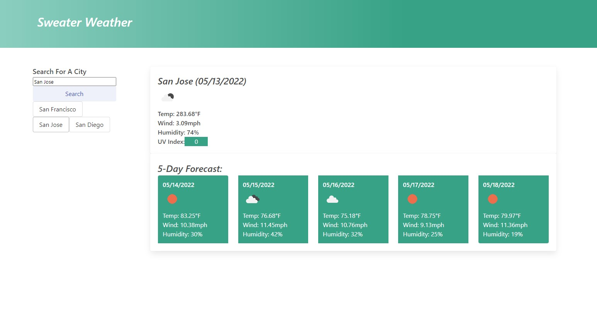

## Weather Dashboard ("Sweater Weather")

## Features Include:
* current and 5-day future conditions for searched city
* history of searched cities
* date, icon representation of weather conditions, temperature, humidity, wind speed, and UV Index
* UV index color will change based on whether conditions are favorable, moderate, or severe

## Languages/Frameworks Used:
* Javascript
* Moment.js
* CSS
* Bulma CSS 
* HTML

## API's Used:
* Openweathermap.org/

## Link to Live Website
https://anukazan.github.io/weather-dashboard/

## Sample Image of Website below

